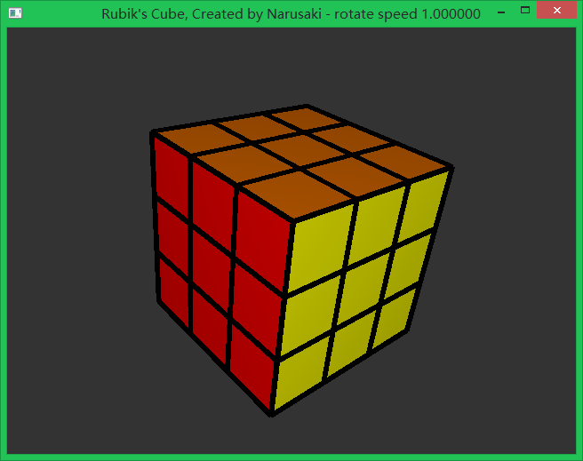
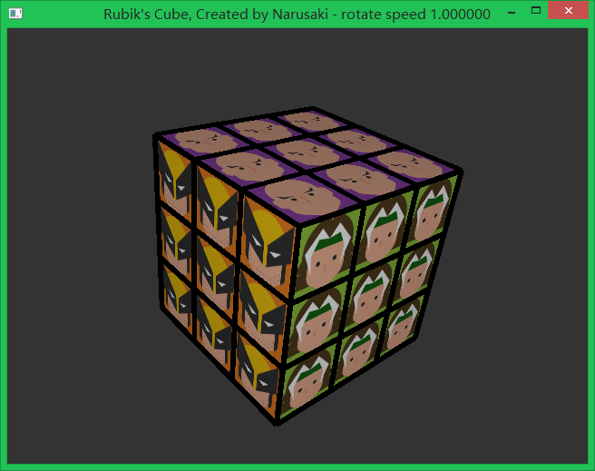
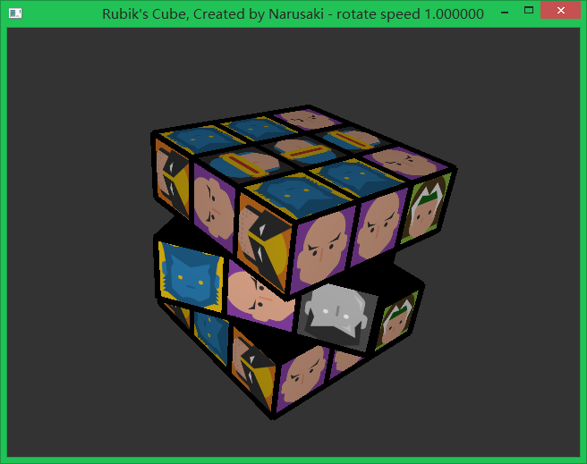

# RubiksCube
A Rubik's Cube demo implemented by fixed pipeline OpenGL.

## Introduction
This is a framework implementation of the Rubik's Cube with order of three or higher and both pure-color and textures supported. The core code of the manipulation of the cube is left blank with hints about how to implement it. 

Following is some snapshots of a complete version.

 
<caption align="bottom">Figure 1. Effect of the Rubik's Cube.</caption>

## Dependencies
This project uses fixed pipeline interfaces provided by OpenGL. For image loading, SOIL library is used.
